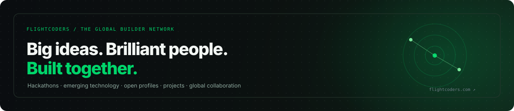

<div align="center">


<br />

[](https://flightcoders.com)
[](https://veyracode.com)
[](https://carrerfit.com)
[](https://www.linkedin.com/in/vikramsde)
[](mailto:kumarv38078@gmail.com)

</div>

## `> whoami`

I'm **Vikram Singh**, a software engineer building at the intersection of **AI systems, developer tools, full-stack products, and enterprise software**.

I prefer projects with a real product surface and a serious technical core — local-first desktop software, AI-assisted workflows, developer infrastructure, career intelligence, backend systems, applied ML, and scalable web applications.

```text
current_direction/
├── ai-native developer tools
├── local-first desktop software
├── intelligent web products
├── applied machine learning
├── backend + data systems
└── developer communities
```

---

## My company & community — FlightCoders

<a href="https://flightcoders.com">
  
</a>

**[FlightCoders](https://flightcoders.com)** is my developer company and global builder community — a place for ambitious developers to discover emerging technology, join hackathons, publish projects, build open profiles, and meet people who want to create.

The idea is simple:

> **Big ideas. Brilliant people. Built together.**

FlightCoders is being shaped around:

- **Hackathons & build challenges** — projects over titles
- **Emerging technology** — AI agents, Rust, local-first, edge AI, WebGPU, privacy tech
- **Builder profiles** — show what you build, not only where you worked
- **Project discovery** — useful software, experiments, and open-source work
- **Global collaboration** — find strong builders across disciplines and geographies

<div align="center">

[**Visit FlightCoders →**](https://flightcoders.com) · [**GitHub Repository →**](https://github.com/fcopensource/flightcoders)

</div>

---

## What I'm building

<table>
<tr>
<td width="50%" valign="top">

### ⚡ [Veyra Editor](https://github.com/fcopensource/veyraeditor)

**Local-first, AI-native code editor**

A desktop coding environment built around native project access, Monaco editing, Git, a real terminal, installable themes/snippets, and multi-provider AI workflows with reviewed edits.

**Core:** Tauri · Rust · React · TypeScript · Monaco

[Repository →](https://github.com/fcopensource/veyraeditor) · [veyracode.com →](https://veyracode.com)

</td>
<td width="50%" valign="top">

### 🎯 [CareerFit](https://github.com/fcopensource/carrerfitnew)

**AI career intelligence platform**

A production-oriented platform connecting live jobs, resume intelligence, ATS analysis, evidence-based matching, interview practice, skill-gap discovery, and application tracking.

**Core:** Next.js · TypeScript · Node.js · Express · AI

[Repository →](https://github.com/fcopensource/carrerfitnew) · [carrerfit.com →](https://carrerfit.com)

</td>
</tr>
</table>

---

## Selected engineering work

| Project | Engineering focus | Stack |
| --- | --- | --- |
| **[FlightCoders](https://github.com/fcopensource/flightcoders)** | Global developer community, hackathons, builder network | Next.js, TypeScript, Node.js |
| **[Veyra Editor](https://github.com/fcopensource/veyraeditor)** | Local-first AI editor and desktop developer tooling | Tauri, Rust, React, Monaco |
| **[CareerFit](https://github.com/fcopensource/carrerfitnew)** | AI career intelligence, jobs, resumes, interviews | Next.js, TypeScript, Node.js |
| **[IntelliThesis](https://github.com/fcopensource/intellithesis)** | AI-assisted research and thesis workflows | Next.js, Express, FastAPI, MongoDB |
| **[High Contrast Subspaces](https://github.com/fcopensource/High-Contrast-Subspaces-for-Density-Based-Outlier-Ranking)** | Density-based anomaly detection and outlier analysis | Python, pandas, NumPy, scikit-learn |
| **[CryptoTrack](https://github.com/fcopensource/CryptoTrack)** | Realtime/historical data pipelines and dashboards | React, Node.js, PostgreSQL, EC2 |

---

## Engineering stack

<div align="center">


<br /><br />


</div>

---

## How I build

```text
understand the real problem
        ↓
design the smallest useful system
        ↓
build the core workflow
        ↓
test the important assumptions
        ↓
ship something real
        ↓
learn → improve → repeat
```

I care about **product usefulness, clean architecture, developer experience, performance, and finishing the build**.

---

## GitHub activity

<div align="center">


<br />


</div>

---

<div align="center">

### `BUILD → SHIP → LEARN → REPEAT`

**Software engineer · AI systems · developer tools · builder communities**

[flightcoders.com](https://flightcoders.com) · [veyracode.com](https://veyracode.com) · [carrerfit.com](https://carrerfit.com)

<br />


</div>
