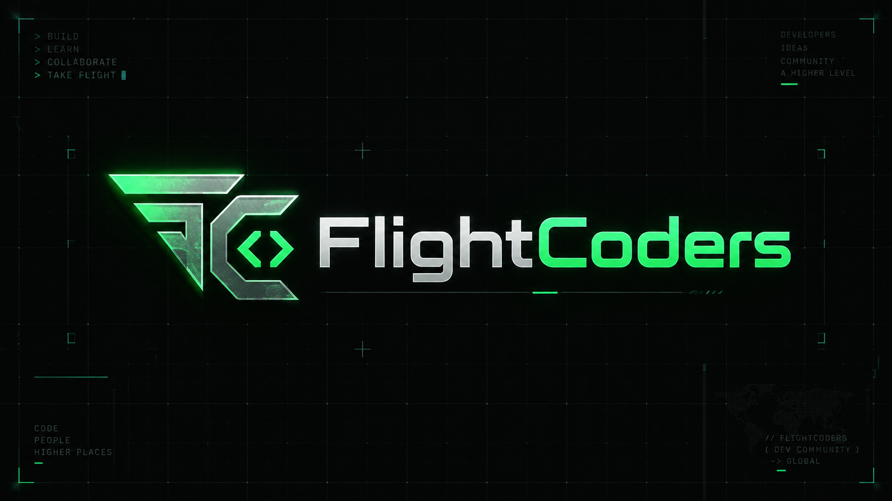
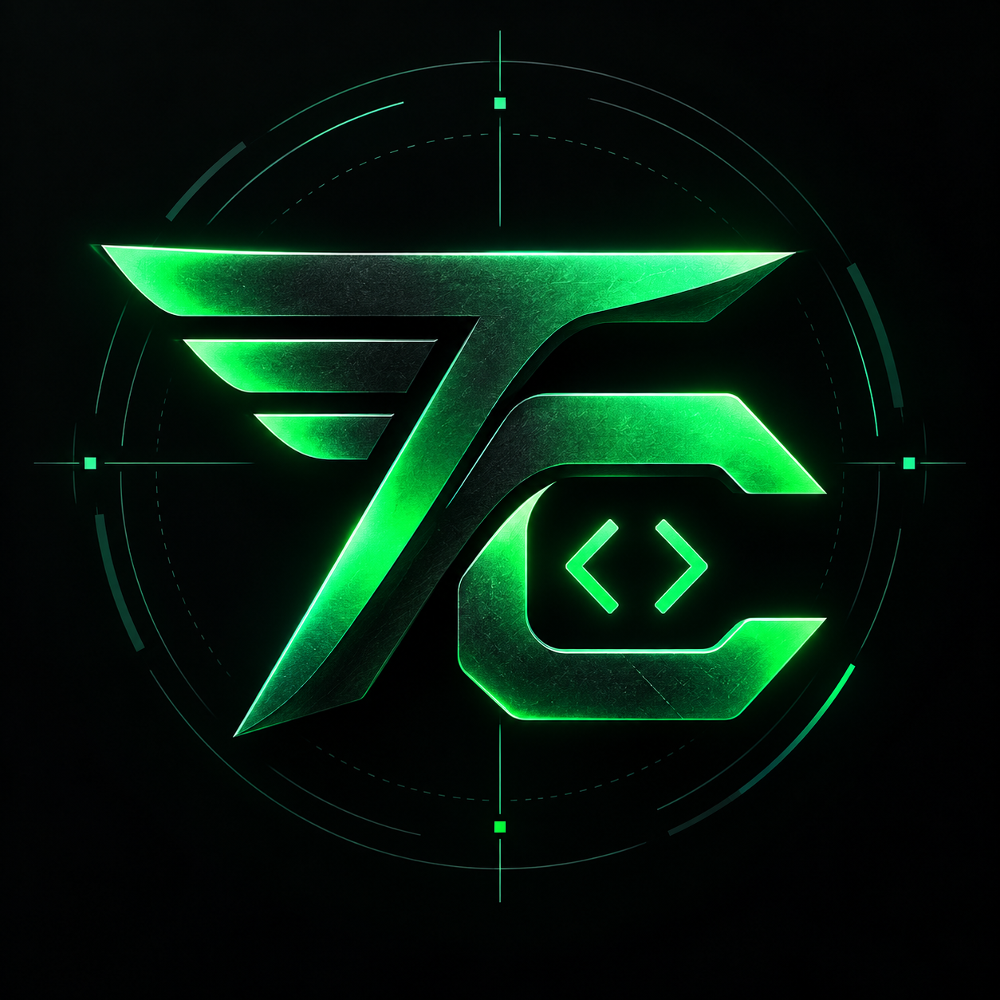

<div align="center">

<a href="https://flightcoders.com"></a>

# Vikram Singh

**Software engineer · AI systems · Developer tools**

Building useful software and a community of people who love making it.

[](https://flightcoders.com)
[](https://github.com/fcopensource?tab=repositories)
[](https://www.linkedin.com/in/vikramsde)

**[Community](https://flightcoders.com/community) · [Veyra Editor](https://veyracode.com) · [CareerFit](https://carrerfit.com) · [Email me](mailto:kumarv38078@gmail.com)**

</div>

---

## A little about the builder

I'm **Vikram**, working across AI-assisted workflows, local-first developer tools, full-stack applications, and enterprise software. I enjoy taking a problem from an early idea through the interface, backend, and details that make it useful.

My current focus is **FlightCoders**, **Veyra Editor**, and **CareerFit**: helping developers connect, build, and discover opportunities.

```text
THE FLIGHT PLAN
│
├── Build tools that make developers more capable.
├── Turn AI experiments into useful product workflows.
├── Share the work, the lessons, and the questions.
└── Bring curious people together to build what comes next.
```

## Built here. Open to exploration.

<table>
<tr>
<td width="50%" valign="top">

### 01 / FlightCoders
**A home for ambitious developers.**

A developer community taking shape around project sharing, questions, coding challenges, and finding collaborators across borders.

`Next.js` `TypeScript` `MySQL`

[Explore the community ↗](https://flightcoders.com/community) · [View source ↗](https://github.com/fcopensource/flightcoders)

</td>
<td width="50%" valign="top">

### 02 / Veyra Editor
**Developer tools, close to your code.**

A local-first, AI-native editor with native project access, Monaco editing, Git, a real terminal, and AI-assisted coding workflows.

`Tauri` `Rust` `React` `Monaco`

[Explore Veyra ↗](https://veyracode.com) · [View source ↗](https://github.com/fcopensource/veyraeditor)

</td>
</tr>
<tr>
<td width="50%" valign="top">

### 03 / CareerFit
**Make the next career step more informed.**

AI career intelligence spanning job discovery, resume analysis, matching, interview practice, and application tracking.

`Next.js` `TypeScript` `Express` `AI`

[Explore CareerFit ↗](https://carrerfit.com) · [View source ↗](https://github.com/fcopensource/carrerfitnew)

</td>
<td width="50%" valign="top">

### 04 / Research & experiments
**Room for the next question.**

Research workflows, anomaly detection, and data applications. A place to explore ideas and learn by implementing them.

[AI research workflows ↗](https://github.com/fcopensource/intellithesis)<br />
[Outlier analysis ↗](https://github.com/fcopensource/High-Contrast-Subspaces-for-Density-Based-Outlier-Ranking)<br />
[CryptoTrack ↗](https://github.com/fcopensource/CryptoTrack)

</td>
</tr>
</table>

## The engineering toolkit

| Area | Tools I work with |
| :--- | :--- |
| Interfaces | React, Next.js, TypeScript, JavaScript, Monaco |
| Backend & APIs | Node.js, Express, Python, Django, FastAPI |
| Desktop & systems | Rust, Tauri, C++, Java |
| Data & infrastructure | PostgreSQL, MySQL, MongoDB, Redis, Docker, AWS |
| Enterprise | Salesforce, Apex, Lightning Web Components |
| Applied ML | pandas, NumPy, scikit-learn |

## Build with me

**Have an idea, a useful bug report, or a different perspective?** Explore a repository and open an issue with the problem, context, and what you have tried. For a larger contribution, start with an issue so we can agree on the direction before implementation.

I'm interested in conversations about developer experience, practical AI, local-first software, and tools that help people do better work.

- **Share something you're building:** [FlightCoders community](https://flightcoders.com/community)
- **Explore the code:** [Public repositories](https://github.com/fcopensource?tab=repositories)
- **Talk about a collaboration:** [LinkedIn](https://www.linkedin.com/in/vikramsde) or [email](mailto:kumarv38078@gmail.com)

---

<div align="center">

<a href="https://flightcoders.com"></a>

### Big ideas. Brilliant people. Built together.

**BUILD · LEARN · COLLABORATE · TAKE FLIGHT**

[flightcoders.com](https://flightcoders.com)

</div>
