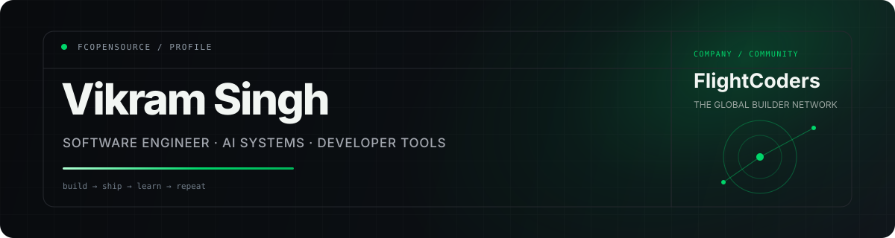

<div align="center">



<br />

[](https://www.linkedin.com/in/vikramsde)
[](https://github.com/fcopensource/veyraeditor)
[](https://carrerfit.com)
[](mailto:kumarv38078@gmail.com)

</div>

## About

I'm a **software engineer focused on AI systems, developer tools, and production web products**.

I like building software that has a clear product surface and a real technical core — desktop tooling, AI-assisted workflows, career intelligence, applied machine learning, backend systems, and scalable web applications.

My current work sits at the intersection of **software engineering + AI + developer experience**.

- Building an AI-native desktop editor with **Tauri, Rust, React, and Monaco**
- Building AI-driven career and interview workflows with **Next.js, Node.js, and TypeScript**
- Working with **Python, FastAPI, Django, ML pipelines, and data systems**
- Experienced with **Salesforce, Apex, LWC, Flows, and enterprise application development**
- Interested in local-first software, intelligent developer tooling, agents, and applied AI

---

## Current focus

<table>
<tr>
<td width="50%" valign="top">

### ⚡ [Veyra Editor](https://github.com/fcopensource/veyraeditor)

**Local-first AI-native code editor**

A desktop coding environment built with **Tauri, Rust, React, TypeScript, and Monaco**. Veyra combines native project access, Git, a real terminal, installable themes/snippets, and multi-provider AI workflows with reviewed edits.

**Stack:** Tauri · Rust · React · TypeScript · Monaco

[Repository →](https://github.com/fcopensource/veyraeditor) · [Website →](https://veyracode.com)

</td>
<td width="50%" valign="top">

### 🎯 [CareerFit](https://github.com/fcopensource/carrerfitnew)

**AI career intelligence platform**

A production-oriented platform for live jobs, resume intelligence, ATS analysis, evidence-based matching, interview practice, skill-gap discovery, and application tracking.

**Stack:** Next.js · TypeScript · Node.js · Express · AI

[Repository →](https://github.com/fcopensource/carrerfitnew) · [Live →](https://carrerfit.com)

</td>
</tr>
</table>

---

## Selected engineering work

| Project | What it explores | Core stack |
| --- | --- | --- |
| **[Veyra Editor](https://github.com/fcopensource/veyraeditor)** | Local-first AI coding environment, desktop tooling, reviewed AI edits | Tauri, Rust, React, TypeScript, Monaco |
| **[CareerFit](https://github.com/fcopensource/carrerfitnew)** | Career intelligence, job ingestion, resume analysis, AI interviews | Next.js, Node.js, TypeScript |
| **[IntelliThesis](https://github.com/fcopensource/intellithesis)** | AI-assisted research and thesis workflows | Next.js, Express, FastAPI, MongoDB |
| **[High Contrast Subspaces / Outlier Ranking](https://github.com/fcopensource/High-Contrast-Subspaces-for-Density-Based-Outlier-Ranking)** | Density-based anomaly detection and outlier analysis | Python, pandas, NumPy, scikit-learn |
| **[CryptoTrack](https://github.com/fcopensource/CryptoTrack)** | Realtime/historical crypto data pipelines and dashboards | React, Node.js, PostgreSQL, EC2 |
| **[Neurolumina](https://github.com/fcopensource/neurolumina)** | LLM interaction and model-training experimentation | TypeScript, Python, FastAPI |

---

## Engineering stack

<div align="center">


<br /><br />


</div>

---

## How I think about building

```text
understand the problem
        ↓
design the smallest useful system
        ↓
build the core workflow
        ↓
measure what actually works
        ↓
ship → learn → improve
```

I care about **product usefulness, clean architecture, developer experience, and actually finishing the build**.

---

## GitHub activity

<div align="center">


<br />


</div>

---

<div align="center">

### Building useful software, one serious project at a time.

<sub>Open to engineering conversations, open-source collaboration, and interesting product problems.</sub>

<br /><br />


</div>
